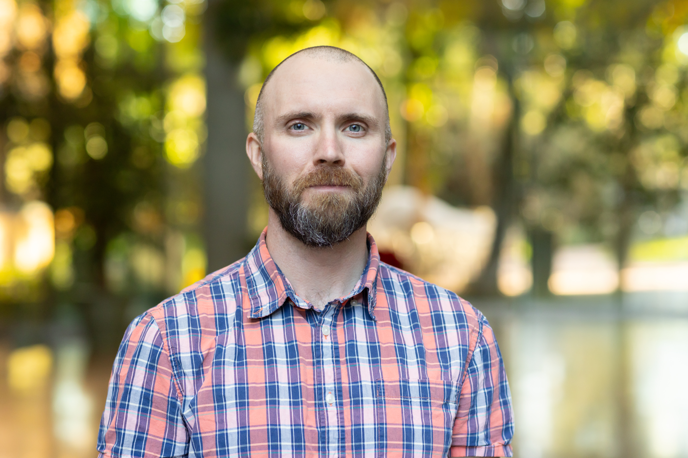

---
eleventyNavigation:
  key: About
  order: 1

layout: /layouts/about.njk
---

# Jeffrey Scarmazzi
After spending 5 years in the Marine Corps as a videographer, I made a transition into IT and found GIS. 

By day, I am a full stack GIS developer for Esri Professional Services. 

At night, I volunteer with [Bird City Brunswick](https://birdcitybrunswick.org/) and build tools to help people tell spatial stories.

