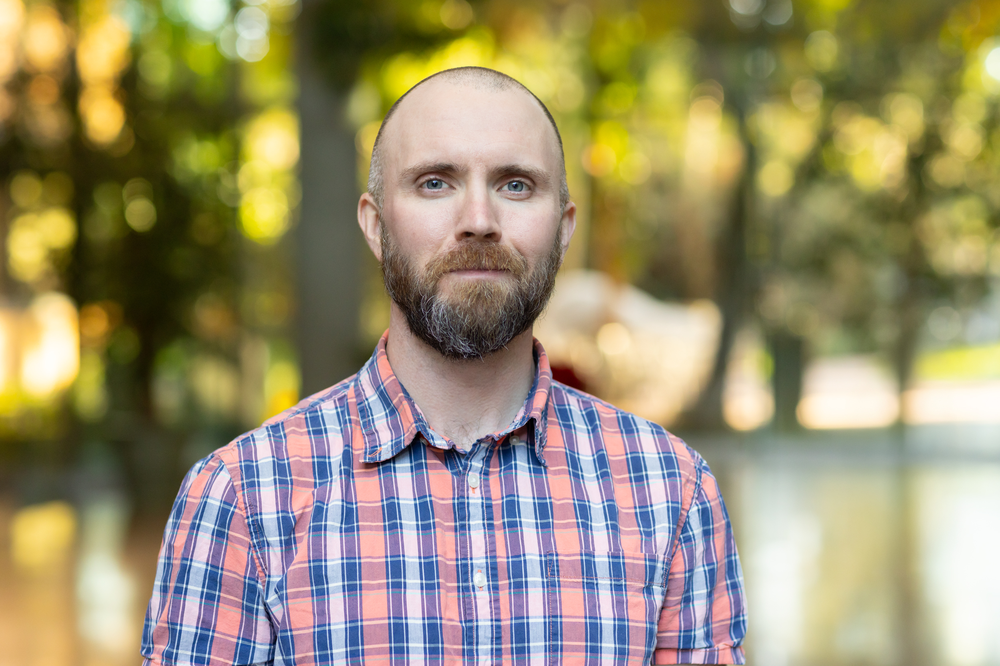

---
eleventyNavigation:
  key: About
  order: 1

layout: /layouts/about.njk
---

# Jeffrey Scarmazzi

After serving 5 years in the Marine Corps as a 4671 Combat Videographer, I discovered GIS and software development. By day, I am a full stack developer, analyst, and consultant for Esri Professional Services. At night, I volunteer with [Bird City Brunswick](https://birdcitybrunswick.org/) and build tools to help people tell spatial stories.

