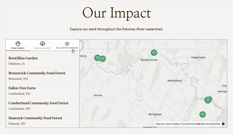

# Website Migration

Wild Potomac wanted to migrate their existing website, built in React and hosted on GitHub Pages, onto a new platform that would allow them to take more control of the site. WordPress quickly emerged as the preferred target for the initial migration. The ability to deploy to mulitple hosting solutions, the framework itself having MySQL baked into the solution, and the robust developer support to add custom functionality via Plugins was very useful.

<!--  -->

We went with [Maplibre](https://maplibre.org/maplibre-gl-js/docs/examples/#__tabbed_1_2) for the interactive maps. The animation controls were fantastic and the 3d capabilities are something we plan to grow into over time.

# Developer Tooling

A huge part of picking WordPress was not only that it's been around forever and super portable. Since we decided to build a custom Plugin, we also needed something that would not be pure misery to implement. The [wp-env](https://developer.wordpress.org/block-editor/getting-started/devenv/get-started-with-wp-env/) tools are fantastic and made my life possible on this project.
